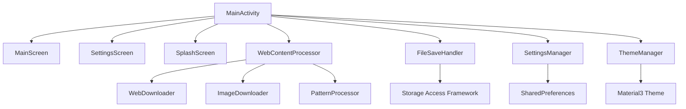

# WebToMarkdown

Android приложение для конвертации веб-страниц в заметки в формате Markdown с поддержкой скачивания изображений.

## Описание

WebToMarkdown - это мобильное приложение для Android, которое позволяет пользователям быстро создавать заметки в формате Markdown из веб-страниц. Приложение автоматически извлекает текстовое содержимое, форматирует его в Markdown и может скачивать изображения для локального хранения.

## Основные возможности

- 🌐 **Конвертация веб-страниц в Markdown** - автоматическое извлечение и форматирование контента
- 🖼️ **Скачивание изображений** - загрузка и сохранение изображений с веб-страниц
- 🎯 **Умные паттерны** - специальная обработка популярных сайтов (Habr, Pikabu, iXBT, Skillbox)
- 💾 **Гибкие настройки сохранения** - выбор папки и формата имени файла
- 🎨 **Темы оформления** - светлая, тёмная и системная темы
- 📱 **Интеграция с системой** - поддержка функции "Поделиться" из браузера
- 🔧 **Настраиваемые параметры** - гибкая конфигурация обработки контента

## Архитектура приложения

### Структура проекта

```
app/src/main/java/com/jack3995/webtomarkdown/
├── MainActivity.kt                    # Главная Activity приложения
├── screens/                          # UI экраны
│   ├── MainScreen.kt                 # Главный экран с формой ввода
│   ├── SettingsScreen.kt             # Экран настроек
│   └── SplashScreen.kt               # Экран загрузки
├── util/                             # Утилиты и бизнес-логика
│   ├── WebContentProcessor.kt        # Обработка HTML → Markdown
│   ├── WebDownloader.kt              # Скачивание веб-страниц
│   ├── ImageDownloader.kt            # Скачивание изображений
│   ├── PatternProcessor.kt           # Обработка по паттернам сайтов
│   ├── FileSaveHandler.kt            # Сохранение файлов через SAF
│   ├── SettingsManager.kt            # Управление настройками
│   └── ThemeManager.kt               # Управление темами
└── ui/theme/                         # Тема оформления
    ├── Theme.kt                      # Основная тема
    ├── Color.kt                      # Цветовая палитра
    └── Type.kt                       # Типографика
```

### Взаимодействие компонентов



## Детальное описание компонентов

### 1. MainActivity.kt
**Роль**: Центральный контроллер приложения

**Ответственность**:
- Инициализация всех менеджеров и утилит
- Управление навигацией между экранами
- Обработка интентов (функция "Поделиться")
- Координация работы между UI и бизнес-логикой
- Управление состоянием приложения

**Ключевые методы**:
- `onCreate()` - инициализация компонентов
- `processUrl()` - запуск обработки веб-страницы
- `saveNote()` - сохранение заметки
- `handleSendIntent()` - обработка внешних ссылок

### 2. WebContentProcessor.kt
**Роль**: Основной процессор контента

**Ответственность**:
- Конвертация HTML в Markdown
- Скачивание и обработка изображений
- Извлечение заголовков и метаданных
- Генерация имён файлов
- Очистка и санитизация контента

**Ключевые методы**:
- `processPage()` - главный метод обработки страницы
- `convertHtmlToMarkdownWithImages()` - конвертация с изображениями
- `convertHtmlToMarkdown()` - базовая конвертация
- `elementToMarkdown()` - рекурсивное преобразование HTML элементов
- `extractTitle()` - извлечение заголовка страницы

**Особенности**:
- Поддержка различных HTML элементов (заголовки, списки, код, ссылки)
- Автоматическое определение языка программирования в блоках кода
- Обработка изображений с приоритетной системой именования
- Интеграция с PatternProcessor для специальной обработки сайтов

### 3. WebDownloader.kt
**Роль**: Скачивание веб-страниц

**Ответственность**:
- HTTP-запросы к веб-серверам
- Обработка ошибок сети
- Получение HTML-контента

**Ключевые методы**:
- `downloadWebPage()` - синхронное скачивание HTML

**Технологии**: OkHttp для HTTP-клиента

### 4. ImageDownloader.kt
**Роль**: Скачивание и обработка изображений

**Ответственность**:
- Загрузка изображений по URL
- Преобразование относительных URL в абсолютные
- Определение типов изображений
- Сохранение файлов в локальную файловую систему

**Ключевые методы**:
- `downloadImage()` - асинхронное скачивание изображения
- `resolveImageUrl()` - преобразование URL
- `isImageUrl()` - проверка типа URL
- `getImageExtension()` - определение расширения файла

**Поддерживаемые форматы**: JPG, PNG, GIF, BMP, WebP, SVG

### 5. PatternProcessor.kt
**Роль**: Специальная обработка популярных сайтов

**Ответственность**:
- Определение подходящего паттерна для сайта
- Извлечение основного контента по специфичным селекторам
- Обработка особых случаев (например, Q&A на Habr)

**Поддерживаемые сайты**:
- **Habr** (`habr.com`) - селектор `#post-content-body`
- **Habr Q&A** (`qna.habr.com`) - специальная обработка вопросов и ответов
- **Pikabu** (`pikabu.ru`) - селектор `.story__content-inner`
- **iXBT** (`ixbt.com`) - селектор `div.b-article__content[itemprop=articleBody]`
- **Skillbox** (`skillbox.ru`) - селектор `div.article-detail-text__setka`

**Архитектура паттернов**:
```kotlin
interface SitePattern {
    fun canHandle(url: String): Boolean
    fun extract(doc: Document, url: String): Element?
    val name: String
    val domains: List<String>
}
```

### 6. FileSaveHandler.kt
**Роль**: Сохранение файлов через Storage Access Framework

**Ответственность**:
- Работа с SAF для выбора папок
- Создание файлов Markdown
- Копирование папок с изображениями
- Обработка отложенного сохранения

**Ключевые методы**:
- `saveNoteWithFullLogic()` - полная логика сохранения
- `saveNoteToSAF()` - сохранение через SAF
- `saveImagesFolderToSAF()` - копирование изображений
- `onFolderPickedUsePending()` - обработка отложенного сохранения

**Особенности**:
- Поддержка отложенного сохранения при выборе папки
- Автоматическое создание папок для изображений
- Очистка временных файлов после сохранения

### 7. SettingsManager.kt
**Роль**: Управление пользовательскими настройками

**Ответственность**:
- Сохранение настроек в SharedPreferences
- Загрузка настроек при запуске
- Валидация значений настроек

**Настройки**:
- `SaveLocationOption` - место сохранения (ASK_EVERY_TIME, CUSTOM_FOLDER)
- `FileNameOption` - формат имени файла (DEFAULT_NAME, PAGE_TITLE)
- `downloadImages` - скачивание изображений
- `usePatterns` - использование паттернов сайтов
- `ThemeOption` - цветовая тема (LIGHT, DARK, SYSTEM)

### 8. ThemeManager.kt
**Роль**: Управление темами оформления

**Ответственность**:
- Создание цветовых схем Material3
- Настройка системных баров
- Адаптация к системной теме

**Ключевые методы**:
- `getColorScheme()` - создание цветовой схемы
- `updateSystemBarsColors()` - настройка системных баров
- `setupSystemBars()` - инициализация системных панелей

### 9. UI Screens

#### MainScreen.kt
**Роль**: Главный экран приложения

**Компоненты**:
- Поле ввода URL
- Поле редактирования имени файла
- Предпросмотр Markdown
- Кнопки управления (Вставить, Очистить, Обработать, Сохранить)
- Индикатор загрузки

**Особенности**:
- Анимированные переходы
- Адаптивная кнопка "Вставить из буфера"
- Валидация полей ввода

#### SettingsScreen.kt
**Роль**: Экран настроек
**Секции**:
- Место сохранения заметки
- Наименование заметки
- Обработка контента (паттерны, изображения)
- Цветовая тема
- Информация о приложении

**Особенности**:
- Интерактивные диалоги с информацией
- Автоматическое сохранение при выходе
- Валидация настроек

#### SplashScreen.kt
**Роль**: Экран загрузки
**Функции**:
- Отображение логотипа приложения
- Инициализация компонентов
- Плавный переход к главному экрану

## Поток данных

### 1. Обработка веб-страницы
```
URL → WebDownloader → HTML → WebContentProcessor → Markdown + Images
```

### 2. Сохранение заметки
```
Markdown + Images → FileSaveHandler → SAF → Файловая система
```

### 3. Управление настройками
```
UI → SettingsManager → SharedPreferences → Persistent Storage
```

## Технологический стек

### Основные библиотеки
- **Jetpack Compose** - современный UI фреймворк
- **Material3** - дизайн-система Google
- **OkHttp** - HTTP-клиент для сетевых запросов
- **JSoup** - парсинг и обработка HTML
- **Kotlin Coroutines** - асинхронное программирование

### Android компоненты
- **Storage Access Framework (SAF)** - безопасный доступ к файлам
- **SharedPreferences** - хранение настроек
- **Activity Result API** - обработка результатов активности
- **Intent Filters** - интеграция с системой

## Конфигурация сборки

### Минимальные требования
- **minSdk**: 26 (Android 8.0)
- **targetSdk**: 36 (Android 14)
- **compileSdk**: 36

### Разрешения
```xml
<uses-permission android:name="android.permission.INTERNET" />
<uses-permission android:name="android.permission.READ_MEDIA_IMAGES" />
<uses-permission android:name="android.permission.READ_MEDIA_VIDEO" />
<uses-permission android:name="android.permission.WRITE_EXTERNAL_STORAGE" />
```

## Версионирование

Приложение использует **Semantic Versioning**:
- **MAJOR.MINOR.PATCH** формат
- **versionCode** для Google Play Store
- Подробная история версий в `versions.md`

Текущая версия: **1.9.5** (versionCode: 33)

## Разработка и сборка

### Требования
- Android Studio Arctic Fox или новее
- JDK 17
- Android SDK 36

### Сборка
```bash
./gradlew assembleDebug    # Debug сборка
./gradlew assembleRelease  # Release сборка
```

### Тестирование
```bash
./gradlew test            # Unit тесты
./gradlew connectedAndroidTest  # Instrumented тесты
```

## Архитектурные принципы

### 1. Разделение ответственности
- **UI слой** - только отображение и взаимодействие
- **Бизнес-логика** - в утилитах и менеджерах
- **Данные** - через специализированные обработчики

### 2. Асинхронность
- Все сетевые операции в корутинах
- UI обновления в Main потоке
- Неблокирующие операции

### 3. Модульность
- Независимые компоненты
- Четкие интерфейсы
- Легкое тестирование

### 4. Безопасность
- SAF для доступа к файлам
- Валидация пользовательского ввода
- Обработка ошибок

## Возможности расширения

### 1. Новые паттерны сайтов
Добавление поддержки новых сайтов через реализацию интерфейса `SitePattern`.

### 2. Дополнительные форматы
Расширение поддержки экспорта в другие форматы (PDF, HTML, etc.).

### 3. Облачная синхронизация
Интеграция с облачными сервисами для синхронизации заметок.

### 4. Расширенная обработка
Добавление поддержки таблиц, математических формул, диаграмм.

## Контакты

- **Разработчик**: Олифер Игорь
- **Email**: jack3995@mail.ru
- **Версия**: 1.9.5

---

*Документация актуальна на момент версии 1.9.5*
